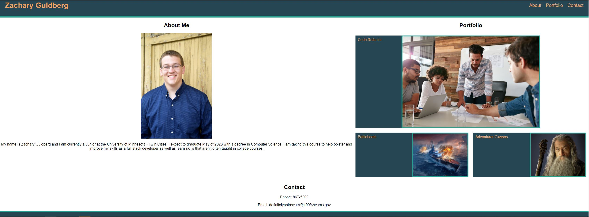

# hw-02-portfolio

This is a portfolio webpage created with HTML and styled with CSS. This portfolio webpage includes the following:
- An about me section which includes a couple lines explaining who I am as well as a picture of myself.
- A portfolio section where when clicked, the pictures link to the GitHub repos with the corresponding code to the listed projects.
- A contact section where in the future there would be information for how to contact me.

**Above is a screenshot that shows the layout of the webpage as well as the aforementioned sections.**

Link to deployed webpage: https://zacharyjg00.github.io/hw-02-portfolio/

